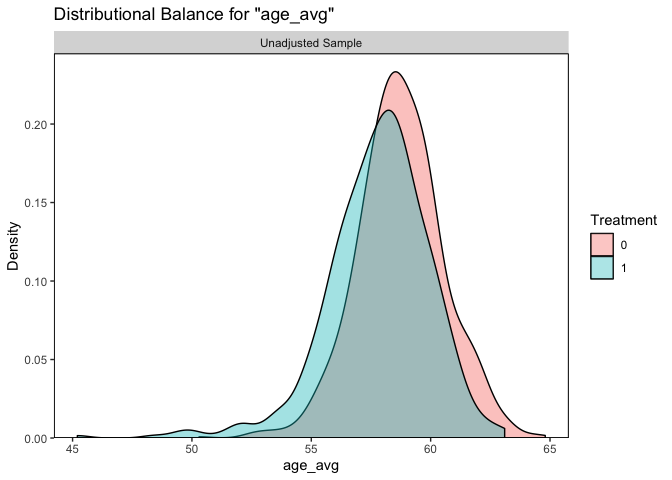
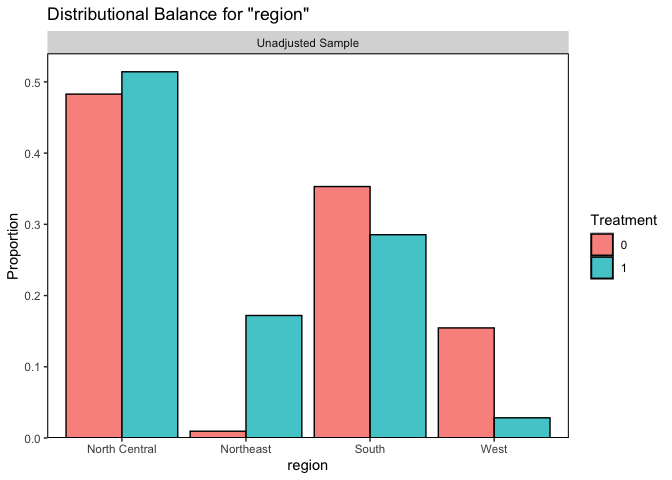
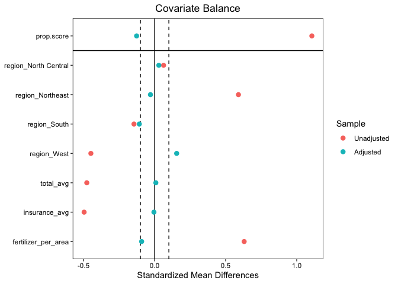
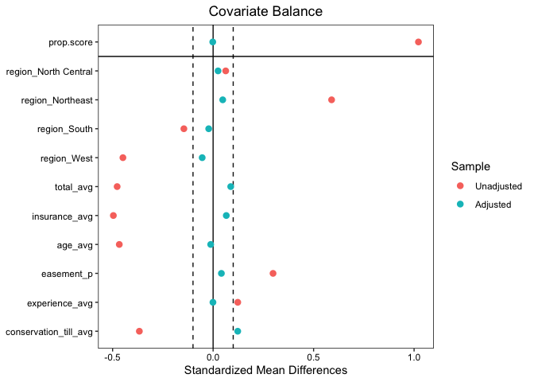
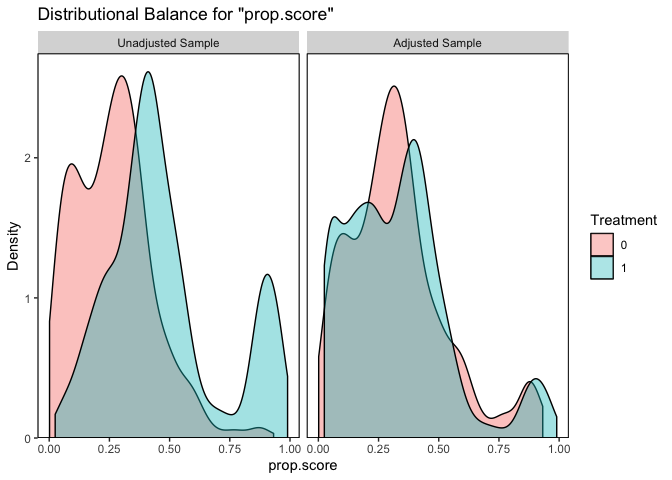

``` r
#import libraries
library(cobalt)
```

    ##  cobalt (Version 4.4.0, Build Date: 2022-08-13)

``` r
library(WeightIt)
library(lmtest)
```

    ## Loading required package: zoo

    ## 
    ## Attaching package: 'zoo'

    ## The following objects are masked from 'package:base':
    ## 
    ##     as.Date, as.Date.numeric

``` r
library(sandwich)
```

``` r
farms_df <- read.csv("farms.csv")
head(farms_df)
```

    ##   total_yield cover_10 region total_avg age_avg experience_avg insurance_avg
    ## 1    61.33234        0  South     0.305    57.2           21.6     0.2543968
    ## 2    47.47099        1  South     0.208    61.2           24.9     0.6386207
    ## 3    46.27485        0  South     0.307    61.0           24.5     0.4223478
    ## 4    81.77405        0  South     0.254    58.8           23.9     1.0557846
    ## 5    81.04827        0  South     0.117    58.0           23.9     0.2556000
    ## 6    58.26087        0  South     0.292    62.5           23.6     0.6138043
    ##   easement_p conservation_till_avg fertilizer_per_area
    ## 1  1.8867925                   145            20.26741
    ## 2  1.5439430                   553            74.62687
    ## 3  0.8032129                    63            15.08367
    ## 4  1.1844332                   391            60.03353
    ## 5  0.5053341                    27            22.93760
    ## 6  2.3454158                   579            25.26148

``` r
#balance plot for the average age
bal.plot(
  x = cover_10 ~ age_avg,
  data = farms_df,
  var.name = "age_avg"
)
```

<!-- -->

``` r
#balance plot for the different regions
bal.plot(
  x = cover_10 ~ region,
  data = farms_df,
  var.name = "region"
)
```

<!-- -->

``` r
#balance table to show SMD (Standardized Mean Differences) and Variance Ratios for all predictor variables according to the treatment group
bal.tab(
  x = cover_10 ~ age_avg + region,
  data = farms_df,
  binary = "std",
  disp.v.ratio = TRUE
)
```

    ## Note: 's.d.denom' not specified; assuming pooled.

    ## Balance Measures
    ##                         Type Diff.Un V.Ratio.Un
    ## age_avg              Contin. -0.4668     1.4521
    ## region_North Central  Binary  0.0627          .
    ## region_Northeast      Binary  0.5896          .
    ## region_South          Binary -0.1454          .
    ## region_West           Binary -0.4488          .
    ## 
    ## Sample sizes
    ##     Control Treated
    ## All    1048     529

- The SMDs are outside of the recommended -0.1 and 0.1 range.
- The variance ratio for age_avg is within the recommended range of
  0.5 - 2.0

``` r
# Calculate IPTW weights with initial propensity score model
farm_iptw <- weightit(
  cover_10 ~ region + total_avg + insurance_avg + fertilizer_per_area,
  data = farms_df,
  estimand = "ATE",
  method = "ps"
)
```

``` r
#plot love plot to evaluate SMD for farm_iptw before and after weighting
love.plot(
  x = farm_iptw,
  binary = "std",
  thresholds = c(m = 0.1)
)
```

<!-- --> Close
after weighting but needs refinement.

``` r
#create new propensity score model with new values
farm_iptw2 <- weightit(
  cover_10 ~ region + total_avg + insurance_avg + age_avg + easement_p + experience_avg + conservation_till_avg,
  data = farms_df,
  estimand = "ATE",
  method = "ps"
)
```

``` r
#plot love plot showing SMD of new propensity score model
love.plot(
  x = farm_iptw2,
  binary = "std",
  thresholds = c(m = 0.1)
)
```

<!-- --> The SMD
values are closer to zero than before, showing that this model is an
improvement.

``` r
#plot bal plot to show propensity scores before and after weighting
bal.plot(
  x = farm_iptw2,
  var.name = "prop.score",
  which = "both"
)
```

<!-- -->

``` r
#fit a regression model for total crop yield as the outcome, cover crop useage as the treatment and other variables from the propensity score model as other predictors
yield_mod <- glm(
  total_yield ~ cover_10 + region + total_avg + insurance_avg + age_avg + easement_p + experience_avg + conservation_till_avg,
  data = farms_df,
  weights = farm_iptw2$weights
)
```

With the regression model fitted, we now need robust standard errors

``` r
#estimate regression parameters for the weighted regression model
coeftest(
  yield_mod,
  vcov. = vcovHC
)
```

    ## 
    ## z test of coefficients:
    ## 
    ##                          Estimate  Std. Error z value  Pr(>|z|)    
    ## (Intercept)           111.0182307  15.4101202  7.2042 5.837e-13 ***
    ## cover_10                3.5768404   1.0373046  3.4482 0.0005643 ***
    ## regionNortheast        -7.8566450   2.4221267 -3.2437 0.0011799 ** 
    ## regionSouth            -3.6146891   1.4750675 -2.4505 0.0142648 *  
    ## regionWest             18.5398103   2.9171803  6.3554 2.079e-10 ***
    ## total_avg             -18.1552947   2.1255363 -8.5415 < 2.2e-16 ***
    ## insurance_avg           6.2900784   2.2013023  2.8574 0.0042708 ** 
    ## age_avg                -1.7556714   0.2890145 -6.0747 1.242e-09 ***
    ## easement_p              0.2464213   0.1659482  1.4849 0.1375627    
    ## experience_avg          2.1238056   0.3191488  6.6546 2.841e-11 ***
    ## conservation_till_avg  -0.0048407   0.0016546 -2.9256 0.0034379 ** 
    ## ---
    ## Signif. codes:  0 '***' 0.001 '**' 0.01 '*' 0.05 '.' 0.1 ' ' 1

The estimate of the ATE (Average Treatment Effect) for cover_10 (at
least 10% of farms have cover crops) on total yield is 3.58. Meaning
that for counties that have at least 10% of farms with cover crops, the
yield increases by 3.58 units (bushels per acre).
